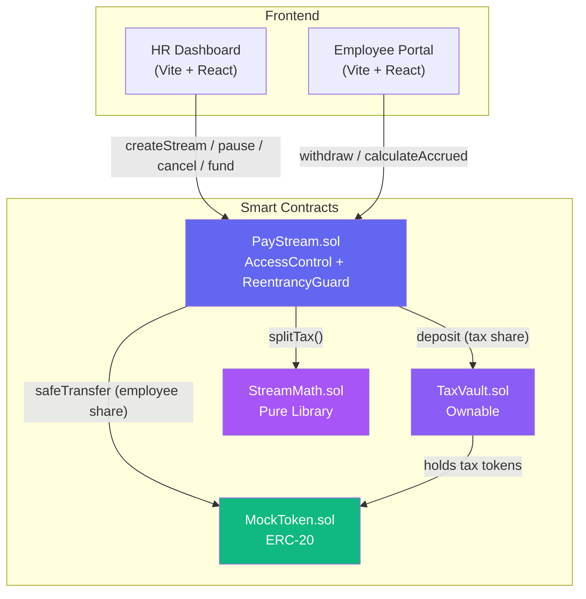
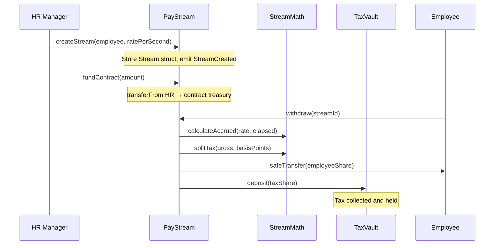

# PayStream Architecture

## System Overview

PayStream is a decentralized payroll streaming system built on EVM-compatible blockchains. Employers stream ERC-20 salaries per-second, employees withdraw anytime, and a configurable percentage (default 10%) is automatically deducted as tax to a vault.

## System Diagram

## Data Flow

## Contract Architecture

| Contract | Inherits | Purpose |
|----------|----------|---------|
| `PayStream.sol` | AccessControl, ReentrancyGuard | Main streaming logic, stream CRUD, withdrawals |
| `TaxVault.sol` | Ownable | Holds tax deductions, admin-only withdrawals |
| `StreamMath.sol` | — (library) | Pure math: `calculateAccrued`, `splitTax` |
| `MockToken.sol` | ERC20 | Test token for local development |
| `IPayStream.sol` | — (interface) | Contract interface with all external functions |

## Tax Model

- Tax is stored as **basis points** (1 bp = 0.01%)
- Default: **1000 bp = 10%**
- On every withdrawal:
  - `taxShare = (grossAmount × taxBasisPoints) / 10000`
  - `employeeShare = grossAmount − taxShare`
- Admin can update via `setTaxRate(newBasisPoints)`

## Security

- **AccessControl**: `HR_ROLE` for stream management, `DEFAULT_ADMIN_ROLE` for tax config
- **ReentrancyGuard**: Protects `withdraw()` against reentrancy
- **Checks-Effects-Interactions**: State updated before external calls
- **SafeERC20**: All token transfers use OZ SafeERC20 wrappers
- **Input validation**: Zero-address checks, zero-amount checks, bounds checks
